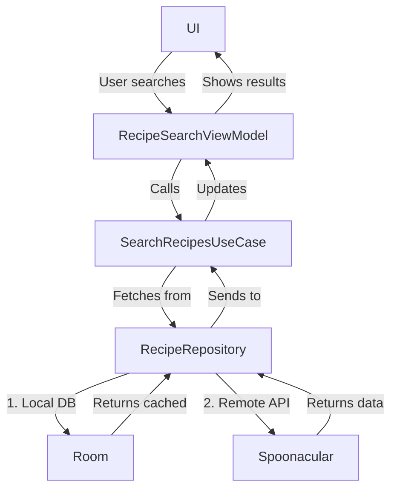

# **Android Architecture Proposal: Recipe Finder App**  

## **App Idea: AI-Powered Recipe Finder**  
A **Recipe Finder** app that allows users to:  
✅ Search recipes by ingredients, diet, or cuisine  
✅ Save favorite recipes & create meal plans  
✅ Get AI-powered recommendations (e.g., "What can I make with these 5 ingredients?")  
✅ Watch cooking videos (optional)  
✅ Generate shopping lists  

---

## **Proposed Architecture: MVVM + Clean Architecture**  

### **1. Presentation Layer (UI & ViewModels)**  
**Technologies**: Jetpack Compose, ViewModel, Navigation, StateFlow  

#### **Key Screens**  
1. **HomeScreen** (Search bar, trending recipes)  
2. **RecipeDetailScreen** (Ingredients, steps, video)  
3. **FavoritesScreen** (Saved recipes)  
4. **MealPlanScreen** (Weekly meal planner)  

#### **ViewModels**  
- `RecipeSearchViewModel` (Manages search queries & results)  
- `RecipeDetailViewModel` (Handles recipe details & videos)  
- `MealPlanViewModel` (Manages saved meal plans)  

#### **State Management**  
```kotlin
sealed class RecipeSearchState {
    object Empty : RecipeSearchState()
    object Loading : RecipeSearchState()
    data class Success(val recipes: List<Recipe>) : RecipeSearchState()
    data class Error(val message: String) : RecipeSearchState()
}
```

---

### **2. Domain Layer (Business Logic)**  
**Pure Kotlin, no Android dependencies**  

#### **Use Cases**  
- `SearchRecipesUseCase` (Finds recipes by query/ingredients)  
- `GetRecipeDetailsUseCase` (Fetches full recipe data)  
- `SaveFavoriteRecipeUseCase` (Stores liked recipes)  
- `GenerateMealPlanUseCase` (AI-powered weekly plan)  

#### **Repository Interface**  
```kotlin
interface RecipeRepository {
    suspend fun searchRecipes(query: String): List<Recipe>
    suspend fun getRecipeDetails(id: String): RecipeDetails
    suspend fun saveFavorite(recipe: Recipe)
    suspend fun generateMealPlan(ingredients: List<String>): MealPlan
}
```

#### **Domain Models**  
```kotlin
data class Recipe(
    val id: String,
    val title: String,
    val imageUrl: String,
    val readyInMinutes: Int,
    val isFavorite: Boolean = false
)

data class RecipeDetails(
    val ingredients: List<Ingredient>,
    val steps: List<String>,
    val videoUrl: String?
)
```

---

### **3. Data Layer (Persistence & Networking)**  

#### **Local Database (Room)**  
- `RecipeEntity` (Stores favorites & meal plans)  
- `RecipeDao` (CRUD operations for saved recipes)  

#### **Remote API (Retrofit + Moshi)**  
- **Edamam API** or **Spoonacular API** (Recipe search)  
- **Firebase Storage** (For user-uploaded recipes)  

#### **Repository Implementation**  
```kotlin
class RecipeRepositoryImpl(
    private val recipeDao: RecipeDao,
    private val apiService: RecipeApiService
) : RecipeRepository {
    override suspend fun searchRecipes(query: String): List<Recipe> {
        val localRecipes = recipeDao.getSavedRecipes(query)
        if (localRecipes.isNotEmpty()) return localRecipes
        
        val remoteRecipes = apiService.searchRecipes(query)
        return remoteRecipes.map { it.toDomainModel() }
    }
}
```

---

### **4. Dependency Injection (Hilt)**  
```kotlin
@Module
@InstallIn(SingletonComponent::class)
object AppModule {
    @Provides
    fun provideRecipeApiService(): RecipeApiService {
        return Retrofit.Builder()
            .baseUrl("https://api.spoonacular.com/")
            .addConverterFactory(MoshiConverterFactory.create())
            .build()
            .create(RecipeApiService::class.java)
    }
}
```

---

### **5. Testing Strategy**  
✅ **Unit Tests**: UseCases, Repository (Mock API/DB)  
✅ **UI Tests**: Compose & Espresso (Mock ViewModels)  
✅ **Integration Tests**: Full search → details flow  

---

### **6. Optional Advanced Features**  
🔹 **AI Integration** (ChatGPT for recipe recommendations)  
🔹 **AR Cooking Assistant** (Step-by-step 3D guides)  
🔹 **Voice Control** ("Hey Google, find vegetarian pasta recipes")  
🔹 **Offline Mode** (Cached recipes + saved meal plans)  

---

## **Why This Architecture?**  
✔ **Scalable** – Easy to add new APIs (e.g., TikTok cooking videos)  
✔ **Testable** – Mock API responses for reliable testing  
✔ **Maintainable** – Clear separation between search logic & UI  
✔ **Extensible** – AI/ML features can be added to Domain layer  

---

### **Flow Diagram (Mermaid)**  


---

### **Need More Details?**  
Let me know if you'd like:  
1. A **full sequence diagram** for recipe search  
2. **Sample code** for a specific component (e.g., Room DAO)  
3. **Another app idea** (e.g., Travel Planner, Book Review App)  

Ready to dive deeper! 🍳📱
